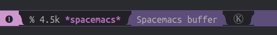

# Spacemacs config for Emacs

These instructions are based on a ubuntu 2018.04 install, running a bash terminal.

## Ansible role installing all of the below

https://github.com/tonymcneil/ADeveloperMachineBootstrap/tree/master/roles/emacs_setup/tasks

## Manual install

I use the convention of listing bash shell commands with a "bash>" prefix so that I can get a list of all commands in this README as follows (then pick and choose which ones to run):

    grep -oP "^\s{4}bash> \K.*" README.md
    
Spacemacs commands are prefixed with "spacemacs>" 

Give apt the ability to install the latest Emacs (emacs 26.3 at time of writing ubuntu only had emacs 25.x)

    bash> sudo add-apt-repository ppa:kelleyk/emacs
    bash> sudo apt install emacs26

Start emacs and note the version is 26.x at top right corner, then exit with spacemacs> SPC q q

Remove any old emacs or spacemacs install / config (i.e. from previous attempts):

    bash> rm -rf ~/.emacs* ~/.spacemacs*

## Install command line tools

### Spell Checking Tool

Aspell is recommended as the spell checking program used by the spell-checking layer, ubuntu/debian install:

    bash> sudo apt install aspell

### Search Tool

Ripgrep is the recommended search tool as configured in .spacemacs config under this entry ("rg"):

    dotspacemacs-search-tools '("rg" "ag" "pt" "ack" "grep")

Install with:

    bash> sudo apt install ripgrep

Or manually install ripgrep: https://github.com/BurntSushi/ripgrep#installation

### XML formatting

    bash> sudo apt install libxml2-utils

  * visually select buffer with spacemacs> C-x h
  * send buffer contents to shell command spacemacs> M-|
    (i.e. spacemacs> Alt-|)
  * Type command spacemacs> xmllint --format -
  * Move to command output window e.g. spacemacs> SPC-2
  * Visually select contents of buffer spacemacs> gg V G
    (goto top, Visual mode, select to bottom)
  * Move to original window e.g. spacemacs> SPC-1
  * Put contents over selected buffer spacemacs> p

### HTML Formatting

Using the following formatting shortcut to format a html file:

    spacemacs> , = =
    
Will prompt to install the following for formatting (requires npm installed obviously):

    bash> npm install -g js-beautify

### Clojure(Script) specific setup

Manually install the clj-kondo linter for use with the clojure layer, see: https://github.com/borkdude/clj-kondo/blob/master/doc/install.md

Current clj-kondo install:

    bash> pushd ~/Downloads
    bash> curl -sLO https://raw.githubusercontent.com/borkdude/clj-kondo/master/script/install-clj-kondo
    bash> chmod +x install-clj-kondo
    bash> sudo ./install-clj-kondo; popd
    
Manually install the joker linter for use with the clojure layer, see: https://github.com/candid82/joker#installation

    bash> echo "******* INSTALL JOKER MANUALLY: https://github.com/candid82/joker#installation *******"
    bash> echo "******* OR using brew... *******"
    bash> brew install candid82/brew/joker

## Install Spacemacs into Emacs

Install spacemacs config from develop branch. I saw many recent posts instructing to do this for the latest features until Spacemacs version 0.300 released i.e. for the latest emacs 26.
(See this page for the "develop" branch reference: https://practicalli.github.io/spacemacs/install-spacemacs/, however the other instructions for cloning the spacemacs.d repository didn't work for me + I wanted to start from a fresh install and configure myself as a learning excercise. As Clojure(Script) is my focus I'll no doubt be coming back to this excellent reference for further guidence).

    bash> git clone --branch=develop https://github.com/syl20bnr/spacemacs ~/.emacs.d

Start emacs at terminal or gui, and it will start downloading and installing all required packages specified by the Spacemacs config under ~/.emacs.d directory

After spacemacs has finished note any errors and warnings then refer to the [Issues](#issues) section below for the common issues I saw and solved.

## Link .spacemacs config file to git tracked file

For tracking configuration tweaks link ~/.spacemacs config to the one tracked in this repo as follows:

    # checkout this project
    bash> export SPACE_CONF_PROJECT=~/Projects/Emacs/SpacemacsConfig
    bash> mkdir -p $SPACE_CONF_PROJECT; pushd $SPACE_CONF_PROJECT
    bash> git clone git@github.com:tonymcneil/SpacemacsConfig.git ./

    # backup original from install
    bash> mv ~/.spacemacs ~/.spacemacs_orig

    # symbolic link from source controlled config to the home directory config
    bash> ln -s $(pwd)/dot_spacemacs ~/.spacemacs
    bash> popd; unset SPACE_CONF_PROJECT

Note that my first change is to switch to a light theme which suits how I roll with inverting screen colours for the whole system (as most things are designed for light themeing I accept that and then use "xcalib -invert -alter" to invert the entire system from light to dark. Besides the light thems are better when you're out in a sunny area with the lappy! 

## Issues

  - First issues out of the blocks was the emacs 25/26 + Spacemacs master/develop decision, which the above instructions solve.
  - Next was a missing gpg key, I think the ppa:kelleyk/emacs ppa step above solves this, but see this issue if it didn't for you: https://github.com/syl20bnr/spacemacs/issues/13054
  - Missing Source Code Pro font issue, see [Install missing font](#install-missing-font) below (peiced together from a few blog posts) 
  - The bottom status bar (powerline) is displaying a little square box with numbers in it. This indicates the fonts on the operating system are missing a unicode char, see [Install powerline fonts](#install-powerline-fonts)
  - The text editor buffer is displaying a little square box with numbers in it where an emoji icon should be. This indicates the fonts on the operating system with the ability to display emojis are missing or not configured in emacs, see [Install fonts for emojis](#install-fonts-for-emojis)


### Install missing font

Fix a font issue, if after installing you see the following Warning:

```
Warnings:
    - Cannot find any of the specified fonts (Source Code Pro)! Font settings may not be correct. 
```

Also the bottom status bar (powerline) is misaligned like this:



Firstly, check for the required fonts (as they're not present on vanilla ubuntu 18.04)

    bash> fc-list | grep 'Source Code Pro'

If output from the above is blank, then:

  - Go to: [Google Font: Source Code Pro](https://fonts.google.com/specimen/Source+Code+Pro)
  - Download the font family (using the button on the page), assuming download to:
    ~/Downloads/Source_Code_Pro.zip

Install the downloaded font:

    bash> export GOOGLE_FONTS_DIR=/usr/share/fonts/googlefonts
    bash> DOWNLOADED_FONT=~/Downloads/Source_Code_Pro.zip
    bash> sudo mkdir -p $GOOGLE_FONTS_DIR
    bash> sudo unzip -d $GOOGLE_FONTS_DIR $DOWNLOADED_FONT
    bash> sudo chmod -R --reference=/usr/share/fonts/opentype $GOOGLE_FONTS_DIR
    bash> sudo fc-cache -fv
    bash> rm $DOWNLOADED_FONT
    bash> unset DOWNLOADED GOOGLE_FONTS_DIR

### Install powerline fonts

The issue is the status bar (powerline) at the bottom is displaying a box with 4 numbers (hex code for unicode char) like this:


The fix to get the fonts installed that should have the unicode icon that's missing install powerline fonts as follows:

    bash> sudo apt install fonts-powerline
    
If the boxes still show then installing this fallback font should also help:

    bash> sudo apt install fonts-nanum

### Install fonts for emojis

The following should allow the buffer to display a basic emoji wireframe icon instead of the square box with number representing unicode:

    bash> sudo apt install fonts-symbola

This worked for me after tinkering with some other settings. Search forums again if it doesn't work on fresh install.

